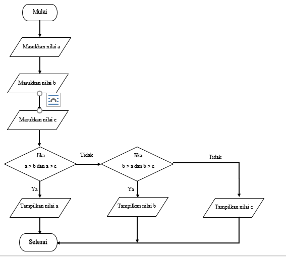

# Modul Praktikum 2
## Latihan 1: Membuat program menentukan nilai akhir
```
nama = input('masukkan nama: ')
uts = input('masukkan nilai uts: ')
uas = input('masukkan nilai uas: ')
tugas = input('masukkan nilai tugas: ')
akhir = (int(tugas) * .2) + (int(uts) * .4) + (int(uts) * .4)
keterangan = ('TIDAK LULUS', 'LULUS')[akhir > 60.0]
if akhir > 80:
    huruf = 'A'
elif akhir > 70:
    huruf = 'B'
elif akhir > 50:
    huruf = 'C'
elif akhir > 40:
    huruf = 'D'
else:
    huruf = 'E'

print("\nNama :",nama)
print("Nilai UAS :",uas)
print("Nilai UTS :",uts)
print("Nilai Tugas :",tugas)  
print("Nilai akhir :",akhir)
print("\nNilai huruf :",huruf)
print("keterangan :",keterangan)

```
Penjelasan:
* Masukkan nilai yang sudah di tentukan oleh variabel, seperti ``nama, uts, uas,tugas``
* untuk ``akhir = (int(tugas) * .2) + (int(uts) * .4) + (int(uts) * .4)``
*


Output:


## Latihan 2: Membuat program menampilkan status gaji karyawan

```
gaji = int(input("Masukkan gaji:"))
berkeluarga = (False, True)[input("Sudah berkeluarga? (Y/T)") == "Y"]
punya_rumah = (False, True)[input("Punya rumah? (Y/T)") == "Y"]
if gaji > 3000000:
 print ("Gaji sudah diatas UMR")
 if berkeluarga:
     print ("Wajib ikutan asuransi dan menabung untuk pensiun")
 else:
     print("Tidak perlu ikutan asuransi")
 if punya_rumah:
     print("Wajib bayar pajak rumah")
 else:
     print("tidak wajib bayar pajak rumah")
else:
    print("Gaji belum UMR")
```
Penjelasan:

Output:


## Latihan 3: penggunaan kondisi OR program membandingkan 3 input bilangan, apabila penjumlahan 2 bilangan hasilnya sama dengan bilangan lainnya, maka cetak pernyataan “BENAR”

```
a = int(input('Masukkan bilangan A: '))
b = int(input('Masukkan bilangan B: '))
c = int(input('Masukkan bilangan C: '))
if a+b == c or b+c == a or c+a == b:
    print('benar')
else: print('salah')
```
Penjelasan:

Output:


## Tugas Praktikum 2


```
A = int(input('Masukkan bilangan pertama: '))
B = int(input('Masukkan bilangan kedua: '))
C = int(input('Masukkan bilangan ketiga: '))

if A > B and A > C:
    print('Nilai', A, 'terbesar dari 3 bilangan yang di inputkan')
elif B > A and B > C:
    print('Nilai', B, 'terbesar dari 3 bilangan yang di inputkan')
else:
    print('Nilai', C, 'terbesar dari 3 bilangan yang di inputkan')
```
Penjelasan:

Output:


Flowchart



